# Hexagonal overview: project setup, data flow, coupling

Project-wide map of `cw_api3d` as a cadwork 3D plugin. Start with the D4 coupling contrast in [`README.md`](README.md). Feature decisions (aggregator policy, dock chrome, colour) live in [`dockable-model-statistics-charts.md`](dockable-model-statistics-charts.md) and [`statistics-chart-colour-and-layout.md`](statistics-chart-colour-and-layout.md). This file is the coupling and data-flow picture those docs assume.

**Colour.** Green = application + ports (no Qt, no CwAPI3D). Blue = driving adapters (Qt / QML). Amber = driven adapters (cadwork SDK / spdlog). Purple = composition root (the only place both sides are named). Red dashed = illegal dependency.

**Two arrow directions.** Runtime calls travel *out* through ports (use case → `IElementCatalog` → adapter). Compile-time dependencies travel *in* (adapter → port ← application). That inversion is the coupling advantage.

**No `src/domain/`.** Value types (`ElementSnapshot`, `StatisticSeries`) live in `src/application/`. Driven-port headers include those types; CMake stays acyclic (`cw_api3d_application` → `cw_api3d_ports`).

---

## D1. System context

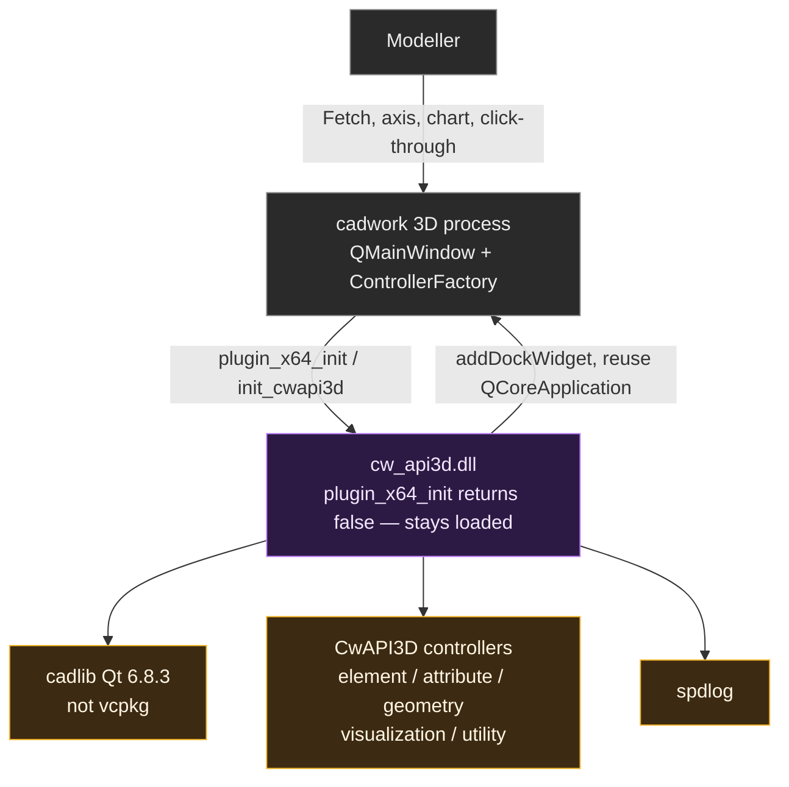

**What it shows.** The plugin is a guest DLL inside cadwork, not a standalone Qt application.

**Coupling rule.** Never construct `QApplication`. Reuse `QCoreApplication::instance()`; if it is null, skip UI.

**Where.** `src/composition/PluginEntry.cpp`, `src/composition/StatisticsPanelWiring.cpp`, `src/composition/HostAbsentQtRuntimeVisibility.cpp`.

---

## D2. Hexagonal layer map (runtime)

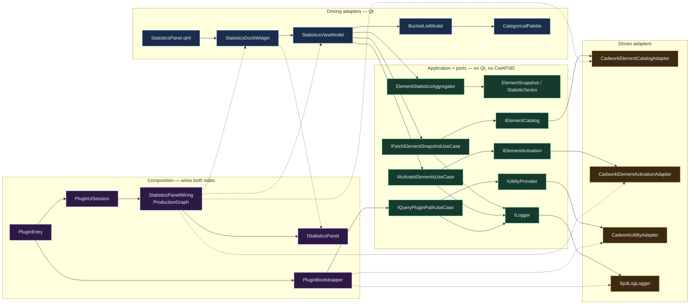

**What it shows.** Real types around the hexagon. `ElementStatisticsAggregator` is not a port: it has no I/O.

**Coupling rule.** Core names ports, never adapters. Adapters implement ports. Composition is the only module that constructs both.

**Where.** `src/ports/`, `src/application/`, `src/adapters/driving/statistics/`, `src/adapters/driven/`, `src/composition/`.

---

## D3. CMake target graph (compile-time coupling)

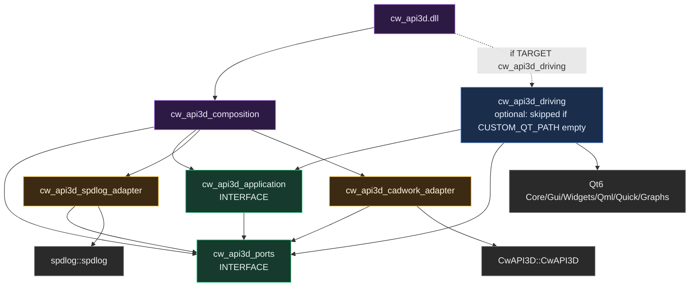

Missing edges that a god-object plugin would have — and this tree does not:

| Illegal link | Why it is absent |
|--------------|------------------|
| `cw_api3d_application` → Qt | aggregator and use cases stay header-only C++23 |
| `cw_api3d_application` → `CwAPI3D` | host types never enter the core |
| `cw_api3d_driving` → `cw_api3d_cadwork_adapter` | QML/ViewModel talk to use cases, not the SDK |
| `cw_api3d_cadwork_adapter` → Qt | driven side does not know about the dock |
| `cw_api3d_composition` → Qt | Qt enters the DLL only through optional `cw_api3d_driving` |

**What it shows.** `target_link_libraries` is the architecture, not a comment.

**Coupling rule.** A CwAPI3D header change does not rebuild application. A QML/Qt change does not rebuild cadwork adapters.

**Where.** `src/*/CMakeLists.txt`, root `CMakeLists.txt`. Driving: `src/adapters/driving/CMakeLists.txt` early-returns when `CUSTOM_QT_PATH` is empty.

---

## D4. Coupling contrast — same feature, two shapes

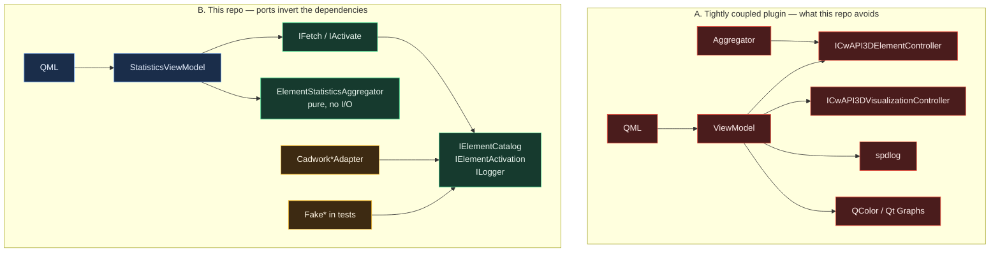

In **A**, UI, host, logging, and charting share includes. Replacing cadwork or unit-testing the aggregator requires the SDK.

In **B**, fan-in is at the ports. `CadworkElementCatalogAdapter` and `FakeElementCatalog` are interchangeable behind `IElementCatalog`. QML never names a controller. The aggregator never names Qt.

**Coupling rule.** Depend on abstractions (`IElementCatalog`, `IFetchElementSnapshotUseCase`), not on cadwork or Qt. Composition, not the view, picks the implementation.

---

## D5. Change blast radius

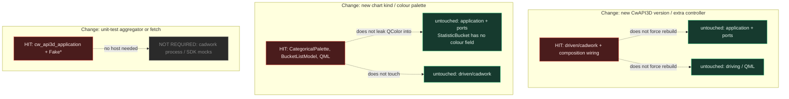

| Change | Hexagonal blast | Coupled blast |
|--------|-----------------|---------------|
| New cadwork SDK | `src/adapters/driven/cadwork/` + `StatisticsPanelWiring.cpp` | every file that included `<cwapi3d/...>` |
| New chart kind / palette | `src/adapters/driving/statistics/` | risk of `QColor` leaking into the aggregator |
| Unit-test aggregator / fetch | `cw_api3d_application` + `tests/doubles/` (no Qt, no SDK) | host process or SDK mocks |

Red is the blast. Green is untouched. Grey is a dependency the coupled design would have required and this one does not.

**What it shows.** The same three changes, with churn confined to the adapter that owns the technology.

**Coupling rule.** Dependency inversion localizes rebuilds and test setup; a coupled plugin would paint every box red.

**Where.** Contrast `src/adapters/driven/cadwork/` vs `src/application/` vs `src/adapters/driving/statistics/`.

---

## D6. Allowed vs forbidden include edges

Allowed (these compile today):

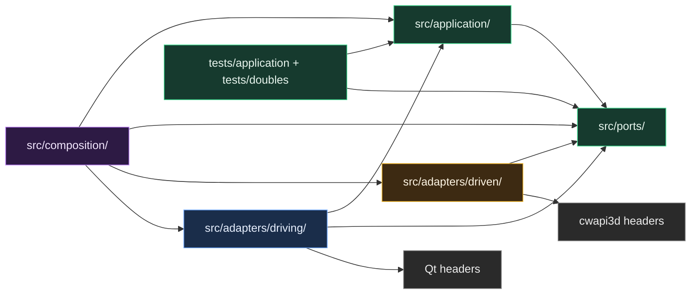

Forbidden (CMake and include discipline reject these):

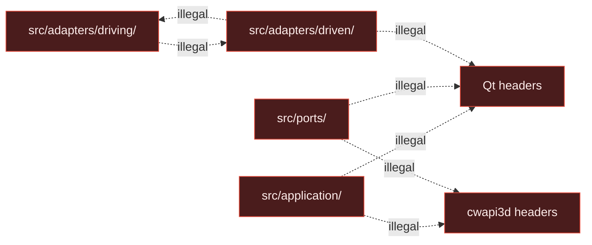

**What it shows.** Hexagonal layering is a *link* rule, not a folder naming scheme.

**Coupling rule.** Driving must not include driven (or the UI is welded to cadwork). Application must not include Qt or CwAPI3D (or tests cannot run without the host).

**Where.** Enforced by CMake `target_link_libraries` (D3). `src/ports` and `src/application` must not `#include` Qt.

---

## D7. Bootstrap sequence

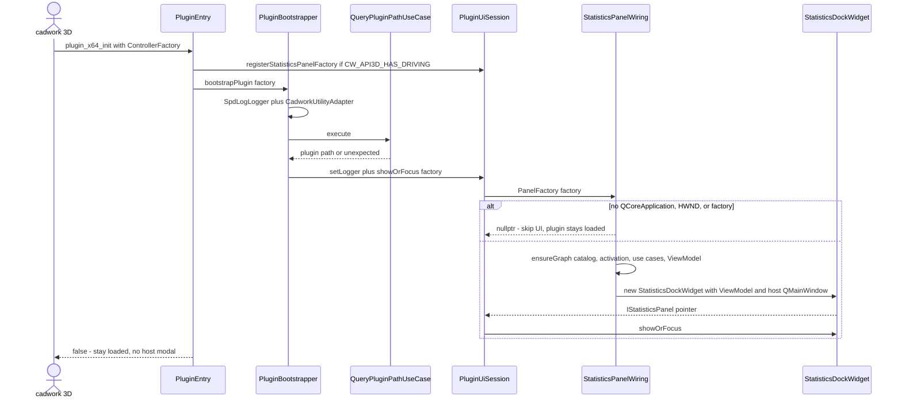

**What it shows.** C exports catch all exceptions. UI construction failure logs and skips the dock; the DLL stays resident.

**Coupling rule.** `PluginEntry.cpp` is the host boundary (`noexcept`, catch-all). Only composition sees `ControllerFactory` and `QMainWindow` together.

**Where.** `src/composition/PluginEntry.cpp`, `Bootstrapping.cpp`, `PluginUiSession.cpp`, `StatisticsPanelWiring.cpp`.

---

## D8. Fetch data flow

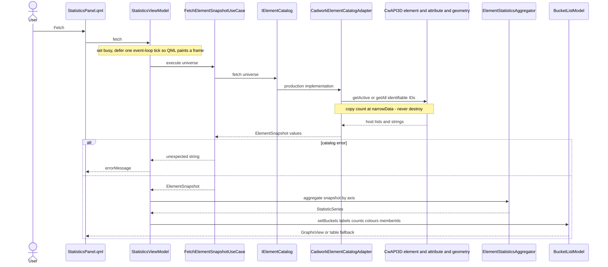

Value types that cross the hexagon: `ElementSnapshot` / `ElementRecord` (copied IDs, strings, `ElementKind`, optional dimensions) and `std::expected<T, std::string>`.

**What it shows.** The host walk is behind `IElementCatalog`. QML never names an element controller.

**Coupling rule.** Host lifetime stays on the cadwork heap. The core receives values, so it can be tested with `FakeElementCatalog`.

**Where.** `StatisticsViewModel.cpp` (`fetch` / `runFetch`), `FetchElementSnapshotUseCase.h`, `CadworkElementCatalogAdapter`.

---

## D9. Axis / chart change — no host I/O

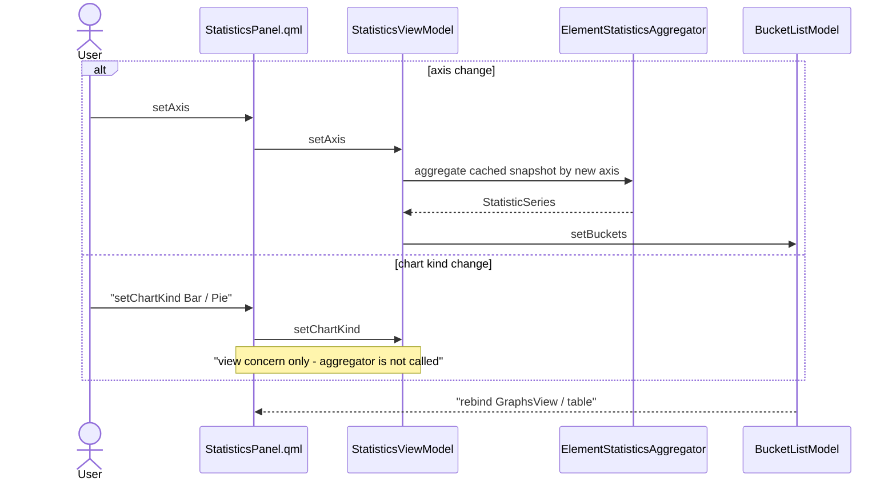

**What it shows.** A cached `ElementSnapshot` is re-sliced in process. Chart kind (`Bar` / `Pie`) never leaves the driving adapter.

**Coupling rule.** Aggregation is not a port because it has no I/O. Keeping it in application means the UI can re-slice without coupling to cadwork.

**Where.** `StatisticsViewModel::reaggregate`, `ElementStatisticsAggregator`, `StatisticAxis` vs ViewModel `ChartKind`.

---

## D10. Click-through activate

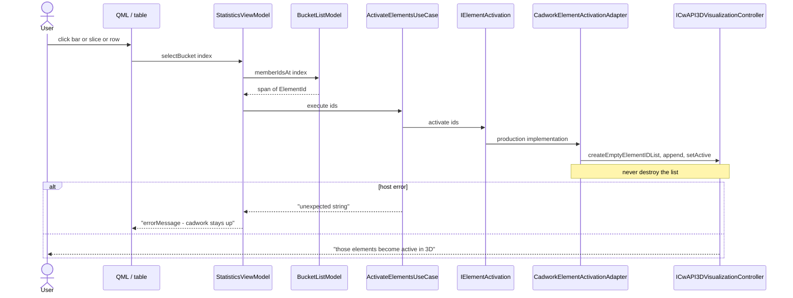

**What it shows.** Member IDs travelled with the snapshot through the core. The visualization controller is not visible to QML or the aggregator.

**Coupling rule.** Click-through is one use-case call. Host list construction stays in the driven adapter.

**Where.** `StatisticsViewModel::selectBucket`, `ActivateElementsUseCase.h`, `CadworkElementActivationAdapter`.

---

## D11. Test substitution — the coupling payoff

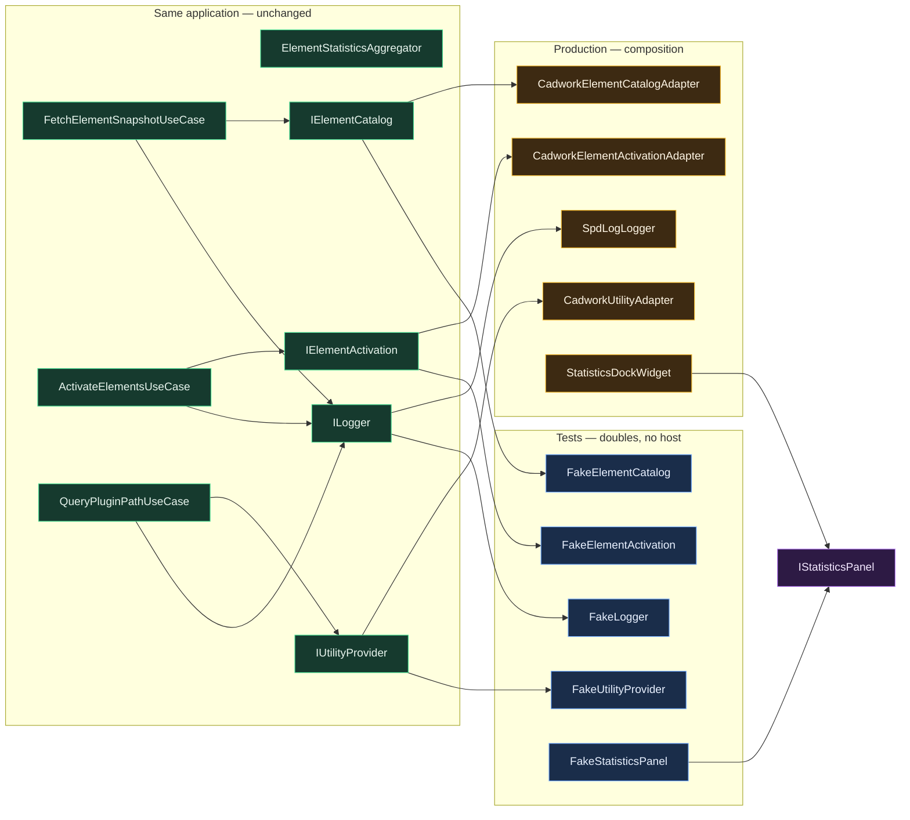

| Production | Test double | Who uses it |
|------------|-------------|-------------|
| `CadworkElementCatalogAdapter` | `FakeElementCatalog` | `FetchElementSnapshotUseCaseTests` |
| `CadworkElementActivationAdapter` | `FakeElementActivation` | `ActivateElementsUseCaseTests` |
| `SpdLogLogger` | `FakeLogger` | use case + composition tests |
| `CadworkUtilityAdapter` | `FakeUtilityProvider` | path use case / `CompositionRootTests` |
| `StatisticsDockWidget` | `FakeStatisticsPanel` | `CompositionRootTests` — no `QMainWindow` |
| real fetch/activate use cases | fake use cases | `StatisticsViewModelTests` (Qt allowed only on that target) |

Application tests link `cw_api3d_application` + `cw_api3d_ports` only. Adapter tests use concept-sized `FakeHost*` so the template adapter compiles without the SDK. Composition tests inject `IStatisticsPanel` so the session's idempotence does not construct a dock.

**What it shows.** Ports are the test seam. The core under test is the same binary shape as production.

**Coupling rule.** If a unit test needs cadwork or Qt to exercise application logic, a port is missing or an adapter leaked inward.

**Where.** `tests/doubles/`, `tests/application/`, `tests/composition/CompositionRootTests.cpp`, `tests/CMakeLists.txt`.

---

## How to read the coupling advantage

Narrative D4 walkthrough (tight vs hex for fetch, re-slice, click-through): [`README.md`](README.md).

1. **D4 + D6** — what would be welded together without ports.
2. **D3** — CMake already forbids those welds.
3. **D8–D10** — data that *does* cross the boundary is copied values, not host objects.
4. **D11** — the same ports that isolate cadwork also isolate tests.

If a new feature needs the host, add a driven port and an adapter. If it needs the UI, add a driving adapter that calls an existing use case (or a new one). Do not include `<cwapi3d/...>` or Qt from `src/application/` or `src/ports/`.
