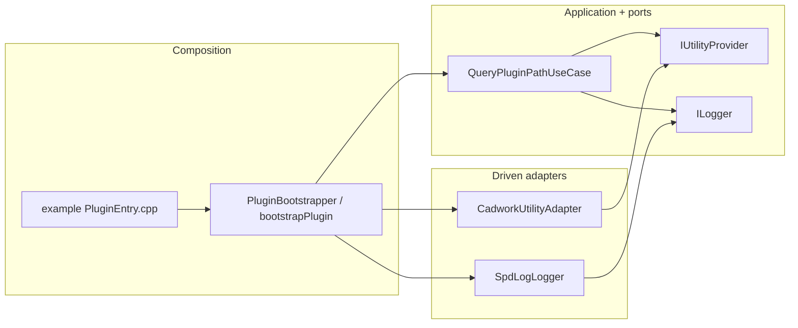

# Hexagonal overview (kit)

The kit is a guest DLL's inner hexagon: log, ask the host for the plugin path, never throw across `plugin_x64_init`.

**Colour.** Green = application + ports (no Qt, no CwAPI3D). Amber = driven adapters (cadwork SDK / spdlog). Purple = composition root.

**Illegal.** Example code must not be compiled into kit targets. Kit `bootstrapPlugin` must not open UI.

Charts (element snapshot, dock, QML): [`examples/charts/docs/architecture/hexagonal-overview.md`](../../examples/charts/docs/architecture/hexagonal-overview.md).
