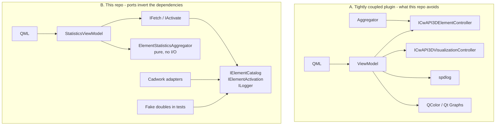
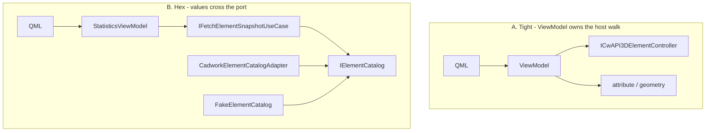
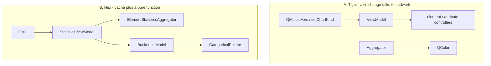
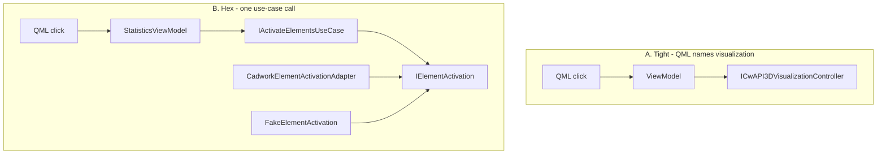

# Architecture (charts example)

`cw_api3d_charts` is a guest DLL inside cadwork 3D, not a standalone Qt application. It links the repo **kit** for logging and plugin-path bootstrap, then adds element snapshot, aggregation, and a dockable Qt Graphs panel. Application and ports never include Qt or CwAPI3D. Composition is the only module that names both sides.

Kit map: [`docs/architecture/README.md`](../../../../docs/architecture/README.md).

This README uses the **D4 method**: the same feature, two shapes. Shape A is the tightly coupled plugin this repo avoids. Shape B is what ships — ports invert the dependencies so UI, host, logging, and charting do not share includes.

The D1–D11 diagram catalog is [`hexagonal-overview.md`](hexagonal-overview.md). Feature decisions live in the docs listed at the end.

---

## The method — same feature, two shapes

In **A**, the ViewModel talks to cadwork controllers, spdlog, and Qt colour types. Replacing the host or unit-testing aggregation requires the SDK.

In **B**, fan-in is at the ports. `CadworkElementCatalogAdapter` and `FakeElementCatalog` are interchangeable behind `IElementCatalog`. QML never names a controller. The aggregator never names Qt.

**Coupling rule.** Depend on abstractions (`IElementCatalog`, `IFetchElementSnapshotUseCase`), not on cadwork or Qt. Composition, not the view, picks the implementation.

Full-size original: [D4 in hexagonal-overview](hexagonal-overview.md#d4-coupling-contrast--same-feature-two-shapes).

---

## Fetch — apply D4

**A.** QML or the ViewModel walks `ICwAPI3DElementController` / attribute / geometry, holds host list pointers, and must know `destroy()` is unsafe.

**B.** QML calls `fetch`. The ViewModel sets busy and defers one event-loop tick so QML paints a frame, then `IFetchElementSnapshotUseCase` reads `IElementCatalog`. The cadwork adapter copies IDs, strings, and dimensions into `ElementSnapshot` values and leaves host lifetime on the cadwork heap.

**Coupling rule.** Host lifetime stays on the cadwork heap. The core receives values, so it can be tested with `FakeElementCatalog`.

Sequence: [D8](hexagonal-overview.md#d8-fetch-data-flow).

---

## Re-slice and chart kind — apply D4

**A.** Changing axis or chart kind hits the SDK again, or colour leaks into the aggregator.

**B.** A cached `ElementSnapshot` is re-sliced in process by `ElementStatisticsAggregator` — a pure function, not a port, because it has no I/O. Chart kind (`Bar` / `Pie`) never leaves the driving adapter. `StatisticBucket` has no colour field; `CategoricalPalette` lives with `BucketListModel`.

**Coupling rule.** Aggregation is not a port because it has no I/O. Keeping it in application means the UI can re-slice without coupling to cadwork.

Sequence: [D9](hexagonal-overview.md#d9-axis--chart-change--no-host-io).

---

## Click-through activate — apply D4

**A.** A bar, slice, or row click reaches `ICwAPI3DVisualizationController` from QML or the ViewModel.

**B.** Member IDs travelled with the snapshot through the core. `selectBucket` is one use-case call: `IActivateElementsUseCase` → `IElementActivation`. The driven adapter builds the host ID list and calls `setActive`. It never destroys that list.

**Coupling rule.** Click-through is one use-case call. Host list construction stays in the driven adapter.

Sequence: [D10](hexagonal-overview.md#d10-click-through-activate).

---

## Blast radius and the test seam

The same inversion that isolates cadwork also isolates tests. If a unit test needs cadwork or Qt to exercise application logic, a port is missing or an adapter leaked inward.

| Change | Hexagonal blast | Coupled blast |
|--------|-----------------|---------------|
| New cadwork SDK | `src/adapters/driven/cadwork/` + `StatisticsPanelWiring.cpp` | every file that included a CwAPI3D header |
| New chart kind / palette | `src/adapters/driving/statistics/` | risk of `QColor` leaking into the aggregator |
| Unit-test aggregator / fetch | `cw_api3d_application` + `tests/doubles/` — no Qt, no SDK | host process or SDK mocks |

| Production | Test double | Who uses it |
|------------|-------------|-------------|
| `CadworkElementCatalogAdapter` | `FakeElementCatalog` | `FetchElementSnapshotUseCaseTests` |
| `CadworkElementActivationAdapter` | `FakeElementActivation` | `ActivateElementsUseCaseTests` |
| `SpdLogLogger` | `FakeLogger` | use case + composition tests |
| `CadworkUtilityAdapter` | `FakeUtilityProvider` | path use case / `CompositionRootTests` |
| `StatisticsDockWidget` | `FakeStatisticsPanel` | `CompositionRootTests` — no `QMainWindow` |

Diagrams: [D5](hexagonal-overview.md#d5-change-blast-radius), [D11](hexagonal-overview.md#d11-test-substitution--the-coupling-payoff).

---

## Catalog

| Diagram | What to use it for |
|---------|--------------------|
| [D1 System context](hexagonal-overview.md#d1-system-context) | Guest DLL, reuse `QCoreApplication`, never construct `QApplication` |
| [D2 Hexagonal layer map](hexagonal-overview.md#d2-hexagonal-layer-map-runtime) | Runtime types around the hexagon |
| [D3 CMake target graph](hexagonal-overview.md#d3-cmake-target-graph-compile-time-coupling) | `target_link_libraries` is the architecture |
| [D4 Coupling contrast](hexagonal-overview.md#d4-coupling-contrast--same-feature-two-shapes) | This method, full size |
| [D5 Change blast radius](hexagonal-overview.md#d5-change-blast-radius) | What a SDK / UI / test change actually rebuilds |
| [D6 Include edges](hexagonal-overview.md#d6-allowed-vs-forbidden-include-edges) | Allowed vs illegal `#include` |
| [D7 Bootstrap](hexagonal-overview.md#d7-bootstrap-sequence) | `plugin_x64_init` → dock or skip UI, DLL stays loaded |
| [D8 Fetch](hexagonal-overview.md#d8-fetch-data-flow) | Snapshot copy across `IElementCatalog` |
| [D9 Axis / chart](hexagonal-overview.md#d9-axis--chart-change--no-host-io) | Re-slice without host I/O |
| [D10 Activate](hexagonal-overview.md#d10-click-through-activate) | Click-through without QML naming visualization |
| [D11 Test substitution](hexagonal-overview.md#d11-test-substitution--the-coupling-payoff) | Same ports, `Fake*` instead of cadwork |

---

## Feature architecture

| Topic | Doc |
|-------|-----|
| Dockable statistics panel, ports, aggregator, MVVM | [`dockable-model-statistics-charts.md`](dockable-model-statistics-charts.md) |
| Per-bucket colour, legend, layout | [`statistics-chart-colour-and-layout.md`](statistics-chart-colour-and-layout.md) |
| Deploying Qt Graphs next to the host | [`deploy-qtgraphs-runtime.md`](deploy-qtgraphs-runtime.md) |

---

## Guardrail

If a new feature needs the host, add a driven port and an adapter. If it needs the UI, add a driving adapter that calls an existing use case (or a new one). Do not include Qt or `<cwapi3d/…>` from `src/application/` or `src/ports/`.
