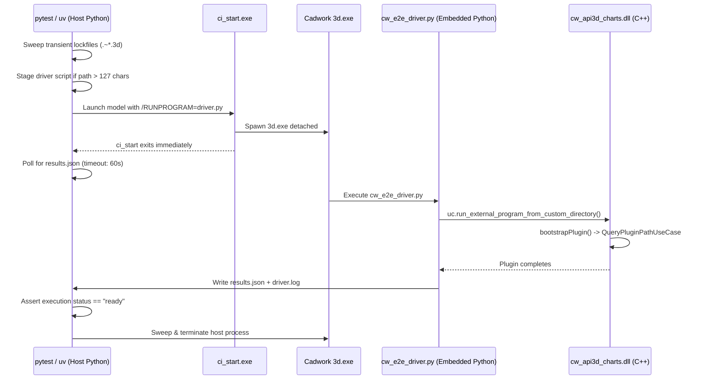

# Test Suites & Verification Guide

This directory contains the automated test suites for `cw-api3d`:

1. **C++ Unit & Integration Tests** (GoogleTest / CTest) — Hermetic unit tests verifying ports, adapters, application use cases, and composition root logic using fast in-memory test doubles.
2. **Python End-to-End (E2E) Test Harness** (pytest + uv) — Live integration tests launching cadwork 3D headlessly, running the embedded driver script, executing `cw_api3d_charts.dll`, and verifying execution status.

---

## 1. Prerequisites

### C++ Build & Test Toolchain
- **Visual Studio 2022** (MSVC toolset **14.44+** required for C++23 features)
- **CMake** (3.25+) and **Ninja**
- **vcpkg** (providing `spdlog`, `fmt`, and `gtest`)

### Python & UV Environment
- **uv** package manager (`winget install astral-sh.uv` or `pip install uv`)
- **Python 3.14** (configured via `.python-version` matching cadwork 3D embedded runtime)
- **cadwork 3D** (v33.0 / 2026+ installed, or tests cleanly skip if not present)

---

## 2. Python Environment Setup via UV

The project manages Python test dependencies and virtual environments with `uv` and `pyproject.toml`.

### Step 1: Sync and Create Virtual Environment
Run `uv sync` in the repository root to automatically resolve dependencies and build the `.venv` environment:
```bash
uv sync
```

### Step 2: Activate the Virtual Environment

- **PowerShell**:
  ```powershell
  .venv\Scripts\Activate.ps1
  ```
- **Command Prompt (cmd.exe)**:
  ```cmd
  .venv\Scripts\activate.bat
  ```
- **Git Bash / Bash**:
  ```bash
  source .venv/Scripts/activate
  ```

Alternatively, you can run commands directly through `uv run` without activating the shell:
```bash
uv run pytest -v
uv run invoke --list
```

---

## 3. Invoke (recommended)

`tasks.py` at the repository root wraps configure / build / CTest / pytest. It loads MSVC toolset **14.44** via `vcvars64.bat`, so a Developer shell is not required. Default preset: `local-relwithdebinfo`.

```powershell
uv sync
uv run invoke build
uv run invoke test
uv run invoke e2e
```

| Task | What it runs |
|------|----------------|
| `configure` | `cmake --preset <preset>` |
| `build` | configure if the Ninja graph is missing (`CMakeCache.txt` / `build.ninja` / `CMakeFiles/rules.ninja`), then `cmake --build out/build/<preset>` |
| `test` | `ctest --test-dir out/build/<preset> --output-on-failure --parallel` (builds first) |
| `e2e` | `uv run pytest -v` (builds first so `cw_api3d_charts.dll` is deployed) |
| `clean` | deletes `out/build/<preset>` only |
| `rebuild` | `clean` then configure + build |
| `dev` | `build` + `test` (does not launch cadwork) |

```powershell
uv run invoke build --preset local-debug
uv run invoke test --filter CompositionRoot
uv run invoke test --no-build
uv run invoke e2e --host-only
uv run invoke e2e --args "-k test_cadwork_paths_resolution"
uv run invoke <task> --help
```

`--host-only` skips `test_plugin_initialization_and_execution` (no live cadwork). `--no-build` skips the C++ rebuild on `test` and `e2e`.

The sections below are the same commands Invoke runs, for when you need to step through them by hand.

---

## 4. Running C++ Tests (GoogleTest / CTest)

### Step 1: Initialize MSVC 14.44 Toolset Environment
In PowerShell or Command Prompt:
```powershell
cmd.exe /c "call ""C:\Program Files (x86)\Microsoft Visual Studio\2022\BuildTools\VC\Auxiliary\Build\vcvars64.bat"" -vcvars_ver=14.44 && pwsh"
```

### Step 2: Configure & Build
Choose a preset (`local-debug`, `local-relwithdebinfo`, or `local-release`):
```bash
# Configure
cmake --preset local-relwithdebinfo

# Build all targets (including test executables and DLL)
cmake --build out/build/local-relwithdebinfo
```

### Step 3: Run via CTest
```bash
ctest --test-dir out/build/local-relwithdebinfo --output-on-failure
```

### Step 4: (Optional) Run Specific Test Executables
Directly execute individual test binaries located under `out/build/<preset>/bin/<config>/`:
```bash
./out/build/local-relwithdebinfo/bin/relwithdebinfo/PortConceptsTests.exe
./out/build/local-relwithdebinfo/bin/relwithdebinfo/QueryPluginPathUseCaseTests.exe
./out/build/local-relwithdebinfo/bin/relwithdebinfo/SpdLogLoggerTests.exe
./out/build/local-relwithdebinfo/bin/relwithdebinfo/UtilityControllerAdapterTests.exe
./out/build/local-relwithdebinfo/bin/relwithdebinfo/CompositionRootTests.exe
```
Filter individual test cases using GoogleTest filter flags:
```bash
./out/build/local-relwithdebinfo/bin/relwithdebinfo/CompositionRootTests.exe --gtest_filter=CompositionRootTests.ProductionBootstrapperResolvesPathFromProvider
```

---

## 5. Running Python E2E Tests (pytest)

The Python E2E harness tests the deployed plugin DLL inside a live cadwork 3D process.

### Step 1: Build and Deploy Plugin DLL First
The CMake build automatically copies `cw_api3d_charts.dll` and runtime dependencies (`spdlog.dll`, `fmt.dll`) into the active cadwork userprofile directory (`<CADWORK_USP>/3d/API.x64/cw_api3d_charts/`):
```bash
cmake --build out/build/local-relwithdebinfo
```

### Step 2: Run All E2E Tests via UV / Pytest
```bash
uv run invoke e2e

# equivalent:
uv run pytest -v
```

### Step 3: Run Offline / Host-Side Unit Tests Only
To run only the host-side staging and path discovery tests without launching cadwork:
```bash
uv run invoke e2e --host-only

# equivalent:
uv run pytest -v -k "not test_plugin_initialization_and_execution"
```

---

## 6. E2E Environment Configuration & Overrides

`cadwork_paths.py` automatically discovers cadwork installation paths from the Windows Registry (`HKCU\Software\cadwork Informatik\ENV`). You can override any path via environment variables:

| Environment Variable | Description | Default / Discovery |
|----------------------|-------------|---------------------|
| `CADWORK_DIR` | Cadwork base installation directory | Registry: `CADWORK.DIR` |
| `CADWORK_USP` | Cadwork userprofile directory | Registry: `CADWORK_USP` / `CISTART_USP` |
| `CADWORK_EXE_DIR` | Directory containing `3d.exe` | `<CADWORK_DIR>/EXE_<YEAR>` |
| `CADWORK_CI_START` | Path to `ci_start.exe` launcher | `<CADWORK_DIR>/ci_start.exe` |
| `CW_API3D_PLUGIN_NAME` | Plugin target / deploy folder | `cw_api3d_charts` |
| `CW_API3D_PLUGIN_DLL` | Path to the deployed plugin DLL | `<CADWORK_USP>/3d/API.x64/cw_api3d_charts/cw_api3d_charts.dll` |

---

## 7. E2E Harness Architecture & Flow


